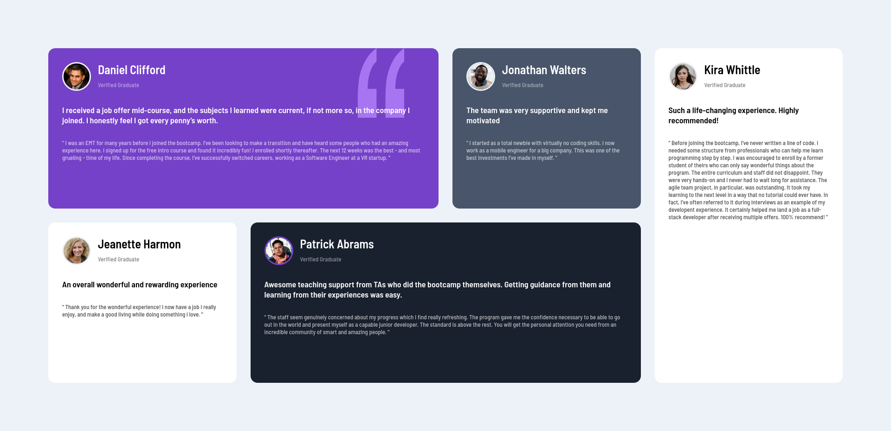

# Frontend Mentor - Testimonials grid section solution

This is a solution to the [Testimonials grid section challenge on Frontend Mentor](https://www.frontendmentor.io/challenges/testimonials-grid-section-Nnw6J7Un7). Frontend Mentor challenges help you improve your coding skills by building realistic projects. 

## Table of contents

- [Overview](#overview)
  - [The challenge](#the-challenge)
  - [Screenshot](#screenshot)
  - [Links](#links)
- [My process](#my-process)
  - [Built with](#built-with)
  - [What I learned](#what-i-learned)
  - [Continued development](#continued-development)
  - [Useful resources](#useful-resources)
- [Author](#author)
- [Acknowledgments](#acknowledgments)

## Overview

### The challenge

Users should be able to:

- View the optimal layout for the site depending on their device's screen size

### Screenshot



### Links

- Solution URL: (https://github.com/francobwogo/tgsm.git)
- Live Site URL: (https://francobwogo.github.io/tgsm/)

## My process

### Built with

- HTML5 markup
- Flexbox
- CSS Grid
- Mobile-first workflow

### What I learned

CSS Grid Layout: 

```css
@media (min-width: 1200px) {
  main {
    max-width: 1440px;
    grid-template-columns: repeat(4, 1fr);
    grid-template-areas:
      "grid-area1 grid-area1 grid-area2 grid-area3"
      "grid-area4 grid-area5 grid-area5 grid-area3"
    ;
  }
}
```

### Continued development

CSS Grid Layout

### Useful resources

- Peter Sommerhoff - CSS Grid Layout Course #09 (https://www.youtube.com/watch?v=iVgKvXSdH68&list=PLpg00ti3ApRzl0Ih-kNez-kM7gpXQkiYm&index=9) - Set Grid Row & Column

## Author

- Frontend Mentor - [@francobwogo](https://www.frontendmentor.io/profile/francobwogo)

## Acknowledgments
- Brendan Hyde - [@hyde-brendan](https://www.frontendmentor.io/profile/hyde-brendan)
